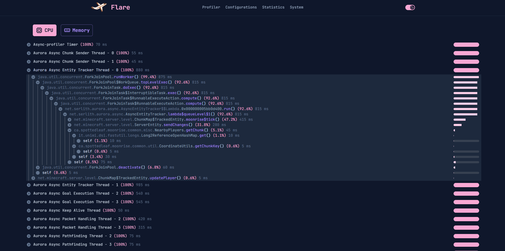

# flare-viewer

> [!WARNING]
> flare-viewer is still under development and is not in a usable state \
> At the moment of writing this, most of the features are missing

An unofficial re-creation of the original [Flare](https://blog.airplane.gg/flare/) viewer


<div align="center">

</div>

### Viewer
Features:
1. CPU and Memory timings for all threads
2. Display server configurations
3. Display system information
4. Display jvm events and server status

### Setting up the project

First generate the protobuf interfaces by running
````shell
  npm run proto
````

Then create start the development environment by running
````shell
  npm run dev
````

### Backend
* [Jet](https://github.com/SerlithNetwork/Jet)

### Client
* [FlarePlatform](https://github.com/SerlithNetwork/FlarePlatform)
* [Pufferfish](https://github.com/pufferfish-gg/Pufferfish) and its forks or re-implementations like [Puffernot](https://github.com/SerlithNetwork/Puffernot)/[Pufferfork](https://github.com/Toffikk/Pufferfork)

### License

flare-viewer is free and open source software, released under the AGPL license. \
Refer to [LICENSE](LICENSE) for details.

