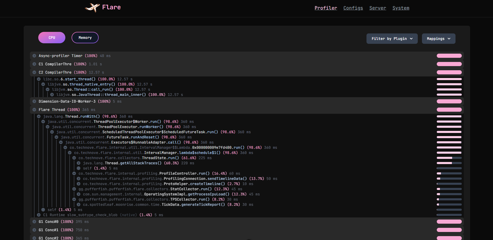

# flare-viewer

An unofficial re-creation of the original [Flare](https://blog.airplane.gg/flare/) viewer


<div align="center">

</div>

### Viewer
Features:
1. CPU and Memory timings for all threads
2. Display server configurations
3. Display system information
4. Display jvm and server statistics

### Setting up the project

First generate the protobuf interfaces by running
````shell
  npm run proto
````

Then create start the development environment by running
````shell
  npm run dev
````

### Compiling for production

Compile the project with SSR support by running
````shell
  npm run build
````

Then run it using
````shell
  npm .output/server/index.mjs
````

### Supported Backends
Flare viewer was designed to work on pair with [Jet](https://github.com/SerlithNetwork/Jet). \
Since the Flare protocol expects a single endpoint for both submitting data and using the web-ui, it is
highly recommended to use a reverse proxy like Nginx or Caddy to forward the requests accordingly.

### Client
Flare viewer is compatible with any platform that provides [Flare](https://github.com/TECHNOVE/Flare)
1. As a standalone plugin \
   1.1. [FlarePlugin](https://github.com/TECHNOVE/FlarePlugin) \
   1.2. [FlarePlatform](https://github.com/SerlithNetwork/FlarePlatform) (recommended)
2. Provided by a server software \
   2.1. [Pufferfish](https://github.com/pufferfish-gg/Pufferfish) and forks \
   2.2. [Puffernot](https://github.com/SerlithNetwork/Puffernot)/[Pufferfork](https://github.com/Toffikk/Pufferfork) and forks (recommended)

### License

flare-viewer is free and open source software, released under the AGPL license. \
Refer to [LICENSE](LICENSE) for details.

